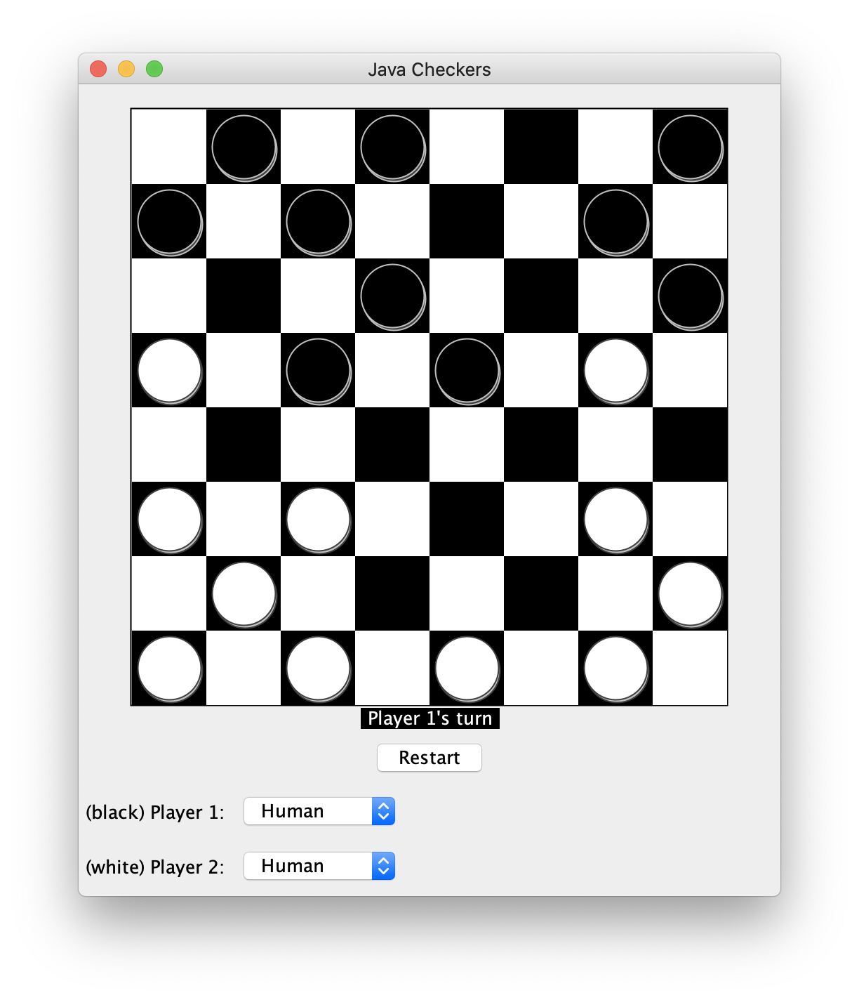
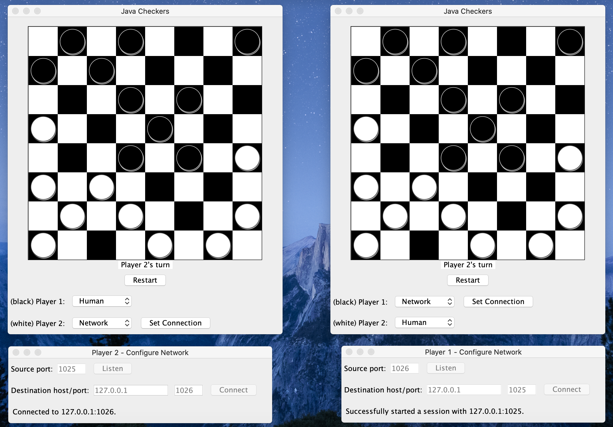

# Java Checkers

## Description
A checkers game with a GUI implemented in Java. The program supports a simple computer player as well as another checkers program instance connected through the network.

The computer player works by assigning a weight for each move. When a move weight is calculated, it is based off information such as move safety (e.g. if the move results in the checker being taken by the other player, it is less likely to make that move). It checks a number of other factors and assigns a final weight. The move with the highest weight is chosen as the move. To ensure computer players are less predictable, if multiple moves have the same weight then one is randomly chosen.

## Compile and Run
### Manual
1. In terminal/command prompt, navigate to `src/`
1. Compile with `javac ui/*.java model/*.java logic/*.java network/*.java`
1. Run with `java ui.Main`

## Features
### User Interface
The checkers program comes complete with all graphical user interface components that scale relative to the size of the window. It is a user-friendly UI and has options to change the type of player for both player 1 and 2, and restart the game. In addition, it provides a checker board UI to show the current game state.

### Different Player Types
Multiple different types of players are supported and can be selected by the user:
1. Human - this is the player that allows the user to interact with the checker board when it is their turn.
1. Computer - implements simple logic to make smart moves, without input from the user.
1. Network - this type of player represents a player on a remote checkers client which can make moves.

All player classes extend the abstract `Player` class and either implement the logic to update the game or allow the user to input their moves.

### Peer to Peer Connections

Each instance of a checkers window/program is network capable. It is able to make connections across the network to other checkers clients. To set up a network player, simply do the following:
1. Select "Network" as the type of player, for the player you want to be controlled by a remote client.
1. Click the "Set Connection" button
1. Enter the source port that this client will listen for connections on (1025 to 65535).
1. Click "Listen".
1. Repeat steps 1 - 4 on the second client but for the other player (e.g. if client 1 has player 2 as a network player, then client 2 needs player 1 as a network player).
1. Enter the host name or IP in the destination host field (e.g. 127.0.0.1, localhost, etc).
1. Enter the destination port that the other client is listening on.
1. Click "Connect".

In addition to peer-to-peer connections, a checkers window can act as a router and forward the game state between two clients if both of the players are network players.

### Network Security
A small amount of security has been put in place for peer-to-peer connections. When a remote client makes a new connection, it receives a randomly generated session ID that must be used in all following messages between the clients. This ensures that another checkers client cannot pretend to be an already connected client and change the game state unexpectedly.
